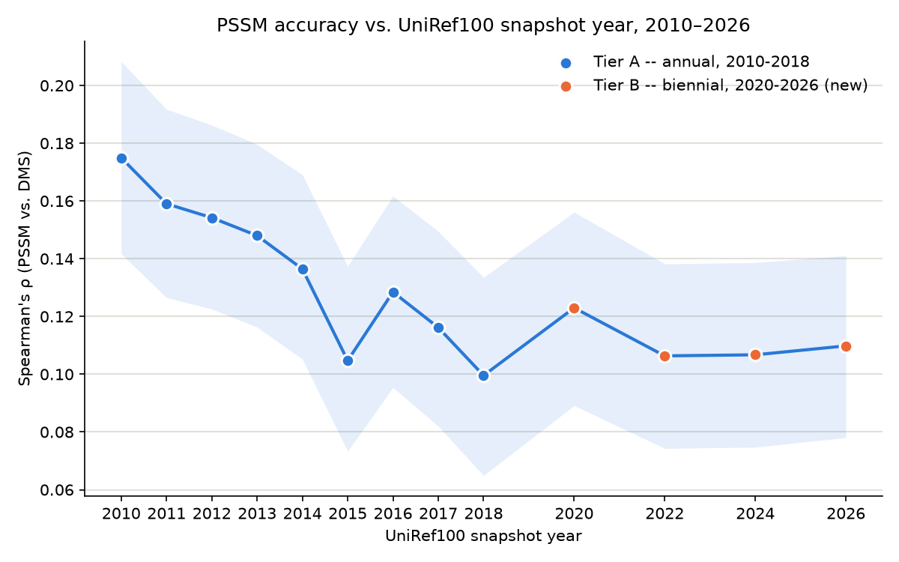

# marginal-value-pathogen-data-v1

## Project

A research project measuring whether PSSM mutation-effect prediction accuracy
(Spearman rho vs. Starr 2020 DMS) change as UniRef100 database snapshots grow
2010→2026, accounting for sequence diversity (e.g Neff@90%ID). It is a
minimal reimplementation of the alignment-based half of the EVEREST pipeline
(Gurev/Youssef/Marks, bioRxiv 2025.08.04.668549).

## Results



Accuracy (Spearman's rho) drops as the database grows through 2018, then
holds roughly flat through 2026 rather than continuing to decline. Source
data: `data/sweep_results.csv` (dictionary in
`data/sweep_results_dictionary.md`); regenerate the plot with
`python scripts/sweep/plot.py`.

## Setup and environment

```bash
./setup.sh
conda activate marginal-value-pathogen-data
```

`setup.sh` installs Miniconda if missing, then creates/updates the
`marginal-value-pathogen-data` conda env from `environment.yml` (Python 3.11,
matplotlib, numpy, pandas, scipy, requests, biopython, and HMMER 3.4 — the
`jackhmmer` binary used by the alignment pipeline). Re-running it is safe.
Some pipeline steps (e.g. `06_evaluate.py`, which needs scipy) require this
conda env specifically — the system `python3` is not sufficient.

There is no test suite, linter, or CI config in this repo. Correctness is
validated per-step via inline sanity checks (see each pipeline script and its
README section) rather than automated tests.

## Running the PSSM pipeline

Steps live under `scripts/pssm_pipeline/`, numbered `00_*.py`–`06_*.py`, one
per stage, each runnable standalone from the repo root and each writing its
checkpoint(s) to `data/pssm_pipeline/` (gitignored — regenerable from the
scripts) so any step's output can be inspected without rerunning earlier ones:

```bash
python scripts/pssm_pipeline/00_setup.py            # canonicalize + validate query.fasta
python scripts/pssm_pipeline/01_jackhmmer_search.py  # jackhmmer search -> raw MSA
python scripts/pssm_pipeline/02_clean_msa.py          # Stockholm -> N x L matrix, EVEREST A.3.1 filters
python scripts/pssm_pipeline/03_weights.py            # 99%-identity sequence reweighting, Neff
python scripts/pssm_pipeline/04_pssm.py               # per-column aa frequency table
python scripts/pssm_pipeline/05_score.py              # log-odds score every DMS variant, per assay
python scripts/pssm_pipeline/06_evaluate.py           # Spearman rho vs each DMS assay, bootstrap CI, scatter
```

Pipeline dependency chain (each step consumes only the previous step's
checkpoint, so steps can be re-run individually after changing one of them):
`00 query.fasta` → `01 msa_raw.sto` → `02 msa_clean.npy` → `03 weights.npy` →
`04 pssm.npy` → `05 predictions.csv` → `06 rho + scatter.png`.

Step 1 requires a local UniRef100 FASTA snapshot on disk (see Data acquisition
below). Which snapshot to search is set by `SEQ_DB` at the top of the script
(default `data/uniref100_2010.fasta`) — override it via the `SEQ_DB`
environment variable to point at a different year without editing the script,
e.g. `SEQ_DB=data/snapshots/uniref100_2015_01.fasta python
scripts/pssm_pipeline/01_jackhmmer_search.py`. The bit-score threshold comes
from the active protein config's `bitscore_per_residue` (see Configuring which
protein); thresholds are length-normalized (bits/residue × query length) rather
than e-value-based, so hit quality stays constant as snapshots grow across years.

## Configuring which protein

Which protein the pipeline runs is set by a small per-protein config file,
selected with the `PROTEIN_CONFIG` env var (default `config/spike.yaml`):

```yaml
name: SARS2_Spike
query_fasta: data/protein.fasta
bitscore_per_residue: 0.3
assays:
  - {id: starr_binding,    csv: data/SARS2_RBD_Starr_binding_dms.csv,  label: Starr 2020 ACE2 binding}
  - {id: starr_expression, csv: data/SARS2_RBD_Starr_expression.csv,   label: Starr 2020 RBD expression}
```

Steps 00 and 01 read the query sequence and the jackhmmer threshold from it;
steps 05 and 06 score *every* assay in the `assays` list against the single
PSSM built for the protein, writing a `predictions_<id>.csv`, `scatter_<id>.png`,
and per-assay meta files. A protein may be measured under multiple phenotypes,
so the config allows several assays per protein. Building the MSA/PSSM
(steps 00–04) is the expensive per-protein work; scoring assays on top of it is
a cheap fan-out.

To run a different protein, copy `config/spike.yaml`, point it at that protein's
query FASTA and DMS assays, and set `PROTEIN_CONFIG` to it. Each assay's DMS
must use the same residue numbering as the query — step 05 reconciles the two
(the WT residue named in each `mutant` must match the query at that position)
and stops if they disagree; there is no coordinate-offset support yet.

## Running the sweep across years

`scripts/sweep/run_sweep.sh` runs the full pipeline (steps 00–06) once per
snapshot year, so a rho-vs-year curve doesn't mean rerunning by hand for each
year:

```bash
PROTEIN_CONFIG=config/spike.yaml scripts/sweep/run_sweep.sh -j 6 2010 2011 2012 2013 2014 2015 2016 2017 2018
python scripts/sweep/collect.py
```

`PROTEIN_CONFIG` selects the protein (default `config/spike.yaml`; see
Configuring which protein). Each year builds one PSSM and scores all the
protein's assays against it, so `collect.py` writes **one row per (year, assay)**
— `data/sweep_results.csv` carries a `dms_id` column, and `plot.py` draws one
line per assay.

**One protein per sweep.** Sandboxes are keyed by year only, not by protein, so
running a second protein reuses the same `$SWEEP_ROOT/<year>` dirs and overwrites
the first. Run proteins serially — sweep one, `collect.py`, save its results,
then the next. (This is the piece that becomes a manifest of proteins when the
project scales past a handful.)

**Regenerate committed artifacts only on the machine with the full snapshot
set.** `collect.py` re-derives `data/sweep_results.csv` and `plot.py` the
`pssm_accuracy_vs_snapshot_year.png` — both git-tracked — from whatever
sandboxes exist under `$SWEEP_ROOT`. On a machine missing snapshots (or that has
only re-run some years), running them produces a partial or mixed-schema table
and overwrites the good one. Re-running the *sweep* rewrites the tracked sandbox
checkpoints under `$SWEEP_ROOT` (a reviewable git diff you can keep or discard);
`collect.py`/`plot.py` then rewrite the derived `data/sweep_results.csv` and
`pssm_accuracy_vs_snapshot_year.png`. Discard any accidental regeneration with
`git checkout -- data/sweep_results.csv pssm_accuracy_vs_snapshot_year.png` (and
the affected sandbox paths).

Each year runs in its own sandbox under `$SWEEP_ROOT/<year>` (env var,
default `data/sweep/`, kept in git as the sweep's analysis record): a directory with symlinks to the shared
scripts, the active config's inputs, and `config/`, plus its own real
`data/pssm_pipeline/`, needed because every pipeline script other than
`01_jackhmmer_search.py` resolves its checkpoint paths relative to the working
directory rather than taking a year argument (`01` itself is pointed at the
right snapshot via the `SEQ_DB` env var, no sandbox needed for that part).
`-j N` caps how many years run concurrently (default 6) — jackhmmer only pins
~2 effective cores per job, so uncapped concurrency oversubscribes the machine
the same way the old fused download+parse worker did (see Data acquisition
below). Reruns are cheap: a year whose sandbox already holds a PSSM built for
the same protein (matching query + threshold) skips the search (steps 00–04)
and only re-scores (steps 05–06), so a rerun after a crash resumes without
re-searching, and adding or changing a DMS assay costs seconds and needs no
snapshot on disk. Changing the query or threshold fails that check and rebuilds.
`collect.py` then re-derives `data/sweep_results.csv` (columns documented in
`data/sweep_results_dictionary.md`) from whatever checkpoints exist under
`$SWEEP_ROOT`, so it's safe to run mid-sweep or after a crash.

## Data acquisition (UniRef100 snapshots)

`scripts/download_uniref100.py` fetches one year's UniRef100 FASTA at a time:

```bash
python scripts/download_uniref100.py --years option2   # this project's locked 13-year set
python scripts/download_uniref100.py --years 2010 2015 --output-dir data/snapshots
```

Historical UniProt releases only ship a combined `uniref{YYYY}_{NN}.tar.gz`
(UniRef50+90+100 together) — no standalone UniRef100 file exists for any
archived year. This script streams that tarball, extracts only the
`uniref100.xml.gz` member (always first in the stream), and aborts the
connection immediately after — UniRef50/90 are never requested.

Two mirrors carry these archives at an identical path layout,
`ftp.uniprot.org` and `ftp.ebi.ac.uk`, and which one is healthy changes without
warning — each has been caught hanging at the TLS handshake, and each has been
seen serving bodies hundreds of times slower than the other. So the script
doesn't hardcode one. At the start of a batch it reads 8 MB from each and pins
whichever is *fastest*, not whichever answers first: a mirror can return
headers promptly while delivering at 0.4 MB/s, which is the difference between
this finishing in an hour and in a fortnight. The chosen mirror is then fixed
for every year in the batch, because a dropped transfer resumes with an HTTP
`Range` request into a still-live decompressor — switching hosts mid-file would
splice two copies together. A mirror dying mid-batch fails those years rather
than rotating; rerun and it re-probes, then resumes from what's on disk.

`--min-free-gb` (default 150) refuses to begin a year's download when the
output volume is below that floor. Peak disk is larger than the final FASTA:
a year's `.xml.gz` is deleted only once its FASTA passes the integrity check,
so concurrent downloads hold several multi-hundred-GB intermediates at once.

Download and parse are two separate, independently-concurrent phases,
connected by the extracted `uniref100.xml.gz` sitting on disk rather than a
live pipe: `--download-workers` (default 4) controls how many years fetch at
once — cheap, network/disk-bound — and `--parse-workers` (default 3) controls
how many `scripts/xml_to_fasta.py` conversions run at once — CPU-bound, and
capped low to keep total memory use predictable. The `.xml.gz` is deleted
once its FASTA is verified. `scripts/xml_to_fasta.py` is a line-oriented
streaming parser (no DOM, memory flat at ~one sequence) and is independently
invocable.

`scripts/run_tier_a_download.sh` and `scripts/run_tier_b_download.sh` launch
the 2010–2018 and 2020/2022/2024/2026 batches respectively as detached
background jobs (`nohup` + PID file under `data/snapshots/`) that survive an
SSH disconnect, logging to `logs/` (gitignored). Check/stop a running download
with the `kill -0`/`kill` commands each script prints on start. Output goes to
`data/snapshots`, which is expected to be a symlink to scratch/NVMe storage —
the root volume does not have room for multi-hundred-GB snapshots.

This repo is checked out on more than one machine (a local Mac and an EC2
instance), and each has its own downloaded snapshots — which years are
present, and where `data/snapshots` actually points, differs per machine and
is deliberately not committed. Check what's on disk (`ls data/snapshots`)
rather than assuming another machine's state.

## Data layout

- `config/*.yaml` — one per-protein config each (query FASTA, bit-score
  threshold, DMS assay list); `config/spike.yaml` is the default. Selected by
  `PROTEIN_CONFIG`; see Configuring which protein. Tracked in git.
- `data/protein.fasta` — query: full-length SARS-CoV-2 Spike (1273 aa),
  precursor numbering. Tracked in git (small, canonical input).
- `data/SARS2_RBD_Starr_binding_dms.csv`, `data/SARS2_RBD_Starr_expression.csv`
  — the two Starr 2020 DMS assays (ACE2 binding and RBD expression, RBD
  positions 331–531), both in the same numbering as the query — no coordinate
  offset needed anywhere in the pipeline.
- `data/pssm_pipeline/` — gitignored scratch/checkpoint dir written by pipeline
  steps 00–06 when run by hand from the repo root; steps 05–06 write one set per
  assay (`predictions_<id>.csv`, `scatter_<id>.png`, …). Regenerate by rerunning
  the relevant script.
- `data/sweep/<year>/` — per-year sweep sandboxes, each a self-contained pipeline
  working dir (its own `data/pssm_pipeline/` plus input symlinks). Tracked in git
  as the analysis record of the completed 2010–2026 sweep; not regenerated on
  machines missing snapshots. See Running the sweep across years.
- `data/snapshots/` — gitignored multi-GB UniRef100 FASTA snapshots (one per
  acquired year) plus `.stats.json` sidecars; typically a symlink to
  scratch/NVMe, not committed or kept on the root volume.
- `data/uniprotref_yearly_archive_sizes.csv` — combined UniRef50+90+100
  archive size per year, used for both the growth plot and
  `download_uniref100.py`'s integrity checks (expected cluster counts).
- `data/sweep_results.csv` — one row per (sweep-driver run, DMS assay), keyed
  by a `dms_id` column; all metrics from every pipeline step (not just rho);
  columns documented in `data/sweep_results_dictionary.md`. Produced by
  `scripts/sweep/collect.py`, not hand-edited.
- `calibration.csv` — timed measurements (wall/CPU/RSS/throughput) from
  early conversion and search calibration runs; referenced by the README's
  "Compute breakdown" section, not consumed by any script at run time.

## Key methodology to preserve when modifying the pipeline

- **Bit-score thresholds, not e-values**, for the jackhmmer search: e-value
  cutoffs would silently tighten as later-year snapshots grow, while
  bits/residue × query length keeps hit stringency constant across the
  2010–2026 sweep.
- **Sequence reweighting at 99% identity** (theta=0.01), not the more common
  80%, because two sequences differing by 1% can already have meaningfully
  different fitness for this protein. Neff/L (effective sequences per column)
  is the depth-adequacy check against EVEREST's floor of 1.0.
- **Column/sequence filtering in `02_clean_msa.py`** (drop columns >50% gaps,
  drop sequences <50% query coverage) is computed against the *original*
  query positions independently for both filters, not against each other's
  output — preserve this independence if the filters are ever touched.
- Coordinate mapping between the MSA, PSSM, and DMS is currently offset-free
  by construction (single-query jackhmmer profile ⇒ match column *i* is query
  position *i*; each DMS and the query already share numbering) — step 05
  reconciles this per assay and stops if it fails to hold. If the query or
  search strategy changes such that the offset-free property breaks, every
  downstream step's coordinate assumptions need re-verification.
