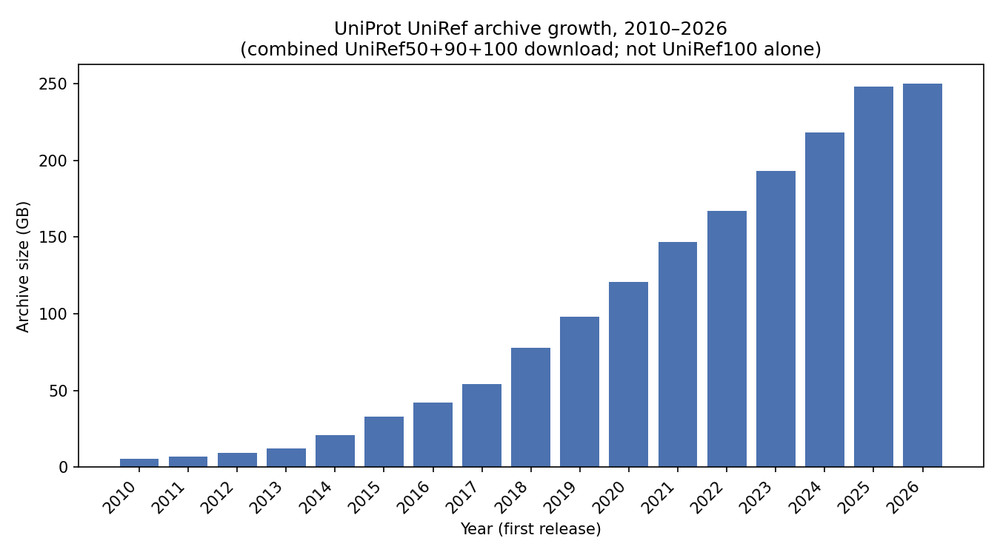

# marginal-value-pathogen-data-v1

**Objective:** Measuring whether removing sequences >90% identical to the SARS-CoV-2 RBD changes PSSM's ability to predict the Starr 2020 ACE2 binding assay, across cumulative database snapshots from 2010 to 2025, with a depth-matched control.

## Setup

Analysis scripts depend on `matplotlib`, distributed via conda. On a fresh machine
(e.g. a new EC2 instance):

```bash
./setup.sh
conda activate marginal-value-pathogen-data
```

`setup.sh` installs Miniconda if it isn't already present, accepts the conda channel
Terms of Service (required non-interactively), and creates/updates the
`marginal-value-pathogen-data` environment from `environment.yml`. Re-running it is safe
and just updates the existing environment.

## Milestones:
### Monday
Come up with objective. Find and download, and the Starr 2020 DMS data for SARS-COV-2 in the [priority-viruses](https://github.com/debbiemarkslab/priority-viruses) repo and parse the N501Y mutation. 

*Deliverable: CSV file with DMS data from Starr 2020 experiment for SARS-COV-2 under data/ and a script that parses the N501Y mutation*

### Tuesday
Find databases needed for SARS-COV-2 multiple sequence alignment (MSA), segmented by year. 

*Deliverable: Database snapshots located, along with the size for each respective database. This will give us an idea of how long it will take to download all the databases on an EC2 instance.* 

As a proxy for overall database growth (and download time), here's the size of
UniProt's combined UniRef50+90+100 [archive](https://ftp.uniprot.org/pub/databases/uniprot/previous_major_releases/release-2011_01/uniref/) across the first release of each year from 
2010–2026 (`see data/uniprotref_yearly_archive_sizes.csv`). Note that this is the size for the compressed file, which may be ~7-8x as large when uncompressed. 



### Wednesday
For SARS-COV-2, build MSA using JackHMMER, fit a PSSM, and compare against DMS, calculating Spearman Coefficient

*Deliverable: A score for the mutation effect prediction of a single protein, and spearman coefficient. *

## Pipeline (alignment-based zero-shot variant effect prediction)

Minimal reimplementation of the alignment-based half of the EVEREST pipeline
(Gurev/Youssef/Marks, bioRxiv 2025.08.04.668549) for SARS-CoV-2 Spike: retrieve
homologs → build MSA → reweight sequences → fit a PSSM → score all single
substitutions in the RBD → Spearman-correlate against the Starr 2020 DMS.

Pipeline scripts live under `scripts/pssm_pipeline/` (numbered `00_*.py` ...
`06_*.py`, one per step, runnable standalone from the repo root). Intermediate
checkpoints live under `data/pssm_pipeline/`, so each step's output can be
inspected independently without rerunning anything.

Query: `data/protein.fasta`, full-length Spike (1273 aa), precursor numbering
(starts at the initiator Met). DMS: `data/SARS2_RBD_Starr_binding_dms.csv`
(Starr 2020 ACE2 binding assay, positions 331-531), which uses this same
numbering — no coordinate offset needed between query and DMS.

Caveats to keep in mind throughout: the EBI HMMER service databases won't
exactly reproduce the paper's UniRef100 pipeline in all details, and only one
bit-score threshold is used here instead of the paper's eighteen alignment
variants, so this will not reproduce EVEREST's reported numbers. PSSM is also
the weakest of the alignment-based models in the paper (avg rho ~0.38 vs 0.44
for EVE) — a single-protein rho in the 0.2-0.5 range is plausible; rho near 0
signals a bug, most likely in coordinate mapping.

### Step 0 — `scripts/pssm_pipeline/00_setup.py`

Canonicalizes the query sequence into `data/pssm_pipeline/query.fasta` and
validates it before any downstream step depends on it: right length, standard
amino acids only, correct start/end.

Run: `python scripts/pssm_pipeline/00_setup.py`

Results:
- L = 1273 (matches full-length Spike)
- Starts `MFVFLVLL...`, ends `...VKLHYT` — correct precursor boundaries
- No non-standard amino acid characters
- Residue composition looks like a typical viral glycoprotein (elevated S/T/L/N)

All sanity checks passed.

### Step 1 — `scripts/pssm_pipeline/01_jackhmmer_search.py`

Submits the query to EBI's jackhmmer web service, which iteratively searches
a sequence database for homologs (sequences descended from a common
ancestor). Each iteration builds a profile from the hits found so far and
re-searches with it, so distantly related sequences that a single-pass search
would miss can still be detected. The inclusion threshold controls how
distant a homolog can be before it's excluded; EVEREST length-normalizes it
(bits/residue x L) so long and short proteins get comparably strict cutoffs.
This step fixes the homolog set that every later step depends on.

Run: `python scripts/pssm_pipeline/01_jackhmmer_search.py`

Results:
- Threshold: 0.3 bits/residue x L=1273 = 381.9 bits (bitscore mode, not
  e-value mode, to match EVEREST's length-normalized threshold directly)
- Converged after 1 iteration (3202 gained, 0 dropped, 0 lost hits between
  iterations -- stable on the first pass)
- 3202 significant hits; 3379 rows in the downloaded Stockholm alignment
  (small discrepancy between the paginated hit-list count and the alignment
  row count -- noted for now, will revisit if Step 2's filtered counts look
  off)
- Top 10 hits: bit scores ~2965-2967, e-value 0, all annotated "Spike
  glycoprotein"
- Query sequence found verbatim in the alignment (UniProt accession
  A0A6G7K2L4 is a 100% match)

All sanity checks passed. Wrote `data/pssm_pipeline/msa_raw.sto` (alignment)
and `data/pssm_pipeline/msa_raw_api_response.json` (raw API responses, for
debugging).

### Step 2 — `scripts/pssm_pipeline/02_clean_msa.py`

Turns the raw Stockholm alignment into a plain N x L positional matrix that
later steps can index into directly. Coordinate mapping is simple here: this
jackhmmer profile was built from a single query sequence (iteration 1), so it
has exactly L=1273 match columns, one per query residue, and match-column
index i *is* query position i with no offset arithmetic needed -- verified by
extracting only the match-column characters from the self-hit row and getting
back the query sequence exactly. Insert columns (residues some hits have that
the query doesn't) are simply discarded.

Then EVEREST's Methods A.3.1 filters apply: columns where most homologs are
gaps get dropped (>50%), since a PSSM position built mostly from placeholders
isn't measuring real conservation; sequences that barely overlap the query
get dropped (<50% coverage), since they contribute little signal but can
still skew frequency counts at the columns they do touch. Both filters are
computed against the original 1273 query positions independently of each
other (not against each other's output), so "50% gaps" and "50% coverage"
mean exactly what they say regardless of filter order.

Run: `python scripts/pssm_pipeline/02_clean_msa.py`

Results:
- Columns: 1273 -> 936 (337 dropped for >50% gaps)
- Sequences: 3379 -> 2525 (854 dropped for <50% query coverage)
- Final matrix shape: (2525, 936)
- Query row: 0 gaps, matches `data/query.fasta` exactly at every one of the
  936 kept positions
- Of the DMS's 201 RBD positions (331-531), only 5 were dropped by the column
  filter -- so Step 5 will only need to impute a small number of variants
- Column gap-fraction distribution is bimodal: most columns sit below ~0.25
  gaps, then a second cluster climbs from ~0.57 up to ~0.71 at the
  worst-covered columns (likely alignment ends / variable loops)

All sanity checks passed. Wrote `data/pssm_pipeline/msa_clean.npy` and
`data/pssm_pipeline/msa_clean_meta.json`.

### Step 3 — `scripts/pssm_pipeline/03_weights.py`

Raw sequence counts overstate the evidence a database provides, because
databases sample what people happened to sequence, not what evolution
actually explored -- a handful of intensively-surveilled lineages can flood
an alignment with thousands of near-duplicate sequences, drowning out
genuinely distinct ones. Sequence weighting corrects for this: each
sequence's weight is 1 over the size of its near-identical cluster, so ten
copies of the same strain collectively count as one independent observation.
EVEREST clusters at 99% identity (theta=0.01) rather than the more common
80%, because two sequences differing by just 1% can already have meaningfully
different fitness for a protein like this. Neff (sum of weights) is the
"effective" number of independent sequences, and Neff/L is the standard
rule-of-thumb for whether there's enough independent evidence per model
position to fit a reliable per-column frequency estimate.

Run: `python scripts/pssm_pipeline/03_weights.py`

Results:
- N=2525, Neff=467.79 at theta=0.01 (99% identity clustering) -- only ~19%
  of the raw sequences count as independent evidence once near-duplicates
  are collapsed
- **Neff/L = 0.500, below EVEREST's depth floor of 1.0.** Under EVEREST's own
  selection heuristic this alignment would not be selected for downstream
  modeling. This isn't a bug -- it's a real consequence of using `uniprot`
  (chosen in Step 1 specifically to preserve near-duplicate strains) against
  a virus sequenced hundreds of thousands of times: the 5 largest clusters
  are sizes 979, 974, 973, 971, 970, meaning roughly 40% of all 2525
  sequences sit in just a handful of near-identical clusters. 343/2525
  sequences are singletons (unique even at 99% identity), so real diversity
  exists, it's just swamped.
- Neff @ 90% identity (Methods A.6.1 reliability metric) = 86.40, which
  **clears** the paper's threshold of 30
- Continuing the pipeline as planned, but the depth-floor failure is a real
  caveat for interpreting the final Spearman correlation, not just a
  formality

All sanity checks passed. Wrote `data/pssm_pipeline/weights.npy` and
`data/pssm_pipeline/weights_meta.json`.

### Step 4 — `scripts/pssm_pipeline/04_pssm.py`

A PSSM (position-specific scoring matrix) is a per-column amino-acid
frequency table: for each of the 936 surviving alignment columns, how often
does each of the 20 amino acids show up, once each sequence's vote is scaled
by its Step-3 weight so that a cluster of near-duplicates doesn't get to vote
once per member. This is the "site-independent" approximation: it captures
how conserved each position is on its own, but says nothing about
correlations between positions (e.g. compensating mutations), which is
exactly what an actual maximum-entropy model like EVE/Hopf et al. 2017 adds
on top.

Run: `python scripts/pssm_pipeline/04_pssm.py`

Results:
- Every column's 20 frequencies sum to 1 (verified)
- Query row still gap-free (0 gaps), as it must be after Step 2
- WT (wild-type) residue -- the amino acid actually present at that position
  in our query sequence, as opposed to a mutant substitution -- is the single
  most frequent amino acid in 891/936 columns (95.2%); the 45 exceptions
  (4.8%) are plausible variable-but-tolerant sites rather than a sign of a
  coordinate-mapping bug
- Per-column entropy ranges from 0.40 to 3.18 bits (max possible for 20
  amino acids is log2(20) = 4.32 bits), mean 1.63 bits
- The 10 most-conserved columns include several cysteines (positions 617,
  649, 840) at freq=0.961 -- consistent with structurally load-bearing
  disulfide-bonded residues, which tolerate almost no substitution
- The 10 least-conserved columns include position 681, immediately adjacent
  to the well-known furin cleavage site (PRRAR) at the spike S1/S2 boundary
  -- a real hypervariable, functionally flexible loop (this is the position
  mutated in the Alpha and Omicron variants, P681H/R), not noise

All sanity checks passed. Wrote `data/pssm_pipeline/pssm.npy` and
`data/pssm_pipeline/pssm_meta.json`.

### Step 5 — `scripts/pssm_pipeline/05_score.py`

For every variant in the DMS (deep mutational scan -- an experiment that
measures a fitness-like readout for thousands of point mutations in
parallel), the predicted score is `log f(mut, pos) - log f(wt, pos)` using
the Step 4 PSSM: the log-ratio of how often the mutant amino acid appears at
that alignment column versus how often the wild-type does. This treats the
alignment as a record of an experiment natural selection already ran --
amino acids tolerated at a position accumulate there in rough proportion to
how little they hurt fitness, so a higher relative frequency is a cheap
proxy for a milder effect. 

Run: `python scripts/pssm_pipeline/05_score.py`

Results:
- WT-residue reconciliation: 3802/3802 (100%) match -- the DMS's `mutant`
  column and `query.fasta` turn out to already share the same full-spike,
  1-indexed coordinates, so no offset correction was needed
- 3707/3802 variants scored directly; 95/3802 (5 positions: 334, 347, 458,
  459, 460) fell outside the 936 surviving MSA columns and were imputed with
  the mean predicted score across the scored variants (-4.55)
- WT->WT sanity check passed: all 196 covered positions score exactly 0.0
- The score distribution skews strongly negative -- mean -4.55, median
  -5.12, 99.9% of scored variants negative. This is more extreme than a mild
  skew, so it was worth checking directly rather than taking at face value:
  it traces back to the Step 3 finding that Neff/L = 0.50 is below EVEREST's
  depth floor. With a comparatively shallow alignment, many of the DMS's
  tested substitutions were never observed even once among the 2525
  weighted homologs, so they land on the pseudocount floor for their
  column -- every unobserved amino acid at a given column gets the *same*
  score. Confirmed directly: all 10 most-deleterious predictions are tied at
  -6.03, all substitutions at position 531 (88.6% conserved threonine)
  where the mutant amino acid's raw weighted count is exactly 0. Not a bug,
  but it compresses ranking resolution among "never observed" variants going
  into Step 6.
- The 10 most-deleterious predictions all sit at position 531, entropy 0.898
  bits -- well below the 1.63-bit alignment-wide mean, i.e. a conserved
  position, as expected
- The 10 least-deleterious predictions have entropy 1.49-2.46 bits, all
  above the alignment-wide mean -- variable, mutation-tolerant positions, as
  expected

All sanity checks passed. Wrote `data/pssm_pipeline/predictions.csv` and
`data/pssm_pipeline/predictions_meta.json`.

### Step 6 — `scripts/pssm_pipeline/06_evaluate.py`

Spearman's rho is Pearson correlation computed on *ranks* rather than raw
values: it asks whether the ordering by predicted score and the ordering by
DMS score move together, ignoring the actual scale of either. That's the
right tool here since the log-odds predicted scores and the DMS's binding
measurement aren't on comparable units -- only their relative order is meant
to carry information. Ties (e.g. Step 5's pseudocount-floor ties) get the
average of the ranks they span, scipy's default and the standard convention.

Run: `python scripts/pssm_pipeline/06_evaluate.py` (needs the project conda
env -- scipy isn't on the system `python3`)

Results:
- Join on (position, wt_aa, mut_aa): 3802/3802 variants matched, 0 dropped
  in either direction -- expected, since `predictions.csv` was built from
  this same DMS file in Step 5, so this join is mostly a consistency check
- **Spearman rho = 0.248** (p=2.5e-54), 95% bootstrap CI [0.217, 0.279] over
  10,000 resamples -- lands within the 0.2-0.5 plausible range flagged
  above, on the lower end
- rho excluding the 95 imputed variants: 0.245 (barely moves) -- confirms
  the imputed variants are contributing close to zero rank signal, as
  designed, rather than propping up or dragging down the headline number
- The scatter plot (`data/pssm_pipeline/scatter.png`) shows the expected
  wedge shape: variants with a high (near-zero) predicted score cluster
  tightly near DMS score 0 (tolerated, as expected for WT-like
  substitutions), while variants at the pseudocount floor (predicted score
  ~-6, "never observed in the alignment") span nearly the *entire* DMS
  range, from tolerated to severely deleterious -- absence from a
  comparatively shallow natural alignment is a weak signal on its own,
  consistent with PSSM being the least informative of the alignment-based
  models

All sanity checks passed. Wrote `data/pssm_pipeline/scatter.png` and
`data/pssm_pipeline/evaluate_meta.json`.

Pipeline steps 0-6 now run end-to-end for one bit-score threshold (0.3
bits/residue). Per the deferred TODO, the next step is re-running Step 1
across the full threshold sweep and applying EVEREST's alignment-selection
heuristic instead of this single hardcoded threshold.

### Thursday
For SARS-COV-2, define the sweeps that we want to run to illustrate the relationship between performance on mutation effect prediction and time (via database snapshots). This should include the compute cost, both in terms of space. 

*Deliverable: A CSV file with runs defined, and the compute cost in terms of CPU hours + RAM for each run*


