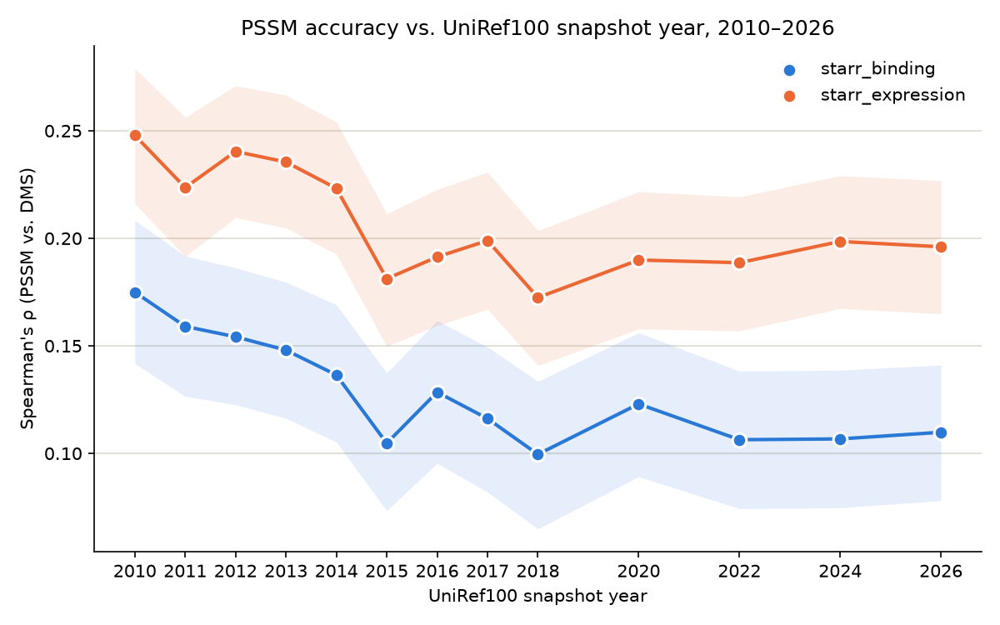
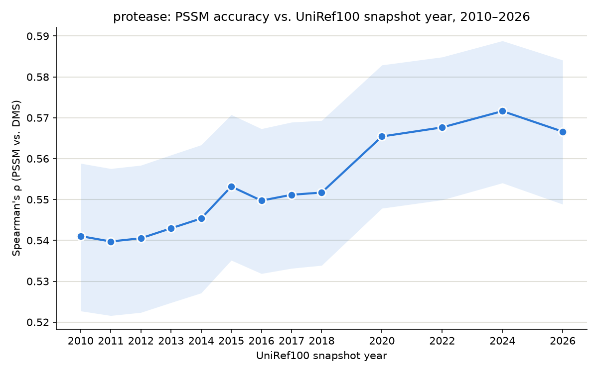

# marginal-value-pathogen-data-v1

## Project

A research project measuring whether PSSM mutation-effect prediction accuracy
(Spearman rho vs. a DMS assay) changes as UniRef100 database snapshots grow
2010→2026, accounting for sequence diversity (e.g Neff@90%ID). It is a
minimal reimplementation of the alignment-based half of the EVEREST pipeline
(Gurev/Youssef/Marks, bioRxiv 2025.08.04.668549; local copy at
`docs/EVEREST.pdf`). Two proteins are currently
swept: SARS-CoV-2 Spike (vs. Starr 2020 DMS) and SARS-CoV-2 main protease
(vs. Flynn fitness DMS) — see Current status below.

## Results




Spike's accuracy (Spearman's rho) drops as the database grows through 2018,
then holds roughly flat through 2026; protease's does not decline at all —
see Current status → Findings below for the numbers and caveats. Source
data: `data/sweep_results.csv` (dictionary in
`data/sweep_results_dictionary.md`); regenerate a plot with
`PROTEIN_CONFIG=config/<name>.yaml python scripts/sweep/plot.py`.

## Setup and environment

```bash
./setup.sh
conda activate marginal-value-pathogen-data
```

`setup.sh` installs Miniconda if missing, then creates/updates the
`marginal-value-pathogen-data` conda env from `environment.yml` (Python 3.11,
matplotlib, numpy, pandas, scipy, requests, biopython, and HMMER 3.4 — the
`jackhmmer` binary used by the alignment pipeline). Re-running it is safe.
Some pipeline steps (e.g. `06_evaluate.py`, which needs scipy) require this
conda env specifically — the system `python3` is not sufficient.

There is no test suite, linter, or CI config in this repo. Correctness is
validated per-step via inline sanity checks (see each pipeline script and its
README section) rather than automated tests.

## Running the PSSM pipeline

Steps live under `scripts/pssm_pipeline/`, numbered `00_*.py`–`06_*.py`, one
per stage, each runnable standalone from the repo root and each writing its
checkpoint(s) to `data/pssm_pipeline/` (gitignored — regenerable from the
scripts) so any step's output can be inspected without rerunning earlier ones:

```bash
python scripts/pssm_pipeline/00_setup.py            # canonicalize + validate query.fasta
python scripts/pssm_pipeline/01_jackhmmer_search.py  # jackhmmer search -> raw MSA
python scripts/pssm_pipeline/02_clean_msa.py          # Stockholm -> N x L matrix, EVEREST A.3.1 filters
python scripts/pssm_pipeline/03_weights.py            # 99%-identity sequence reweighting, Neff
python scripts/pssm_pipeline/04_pssm.py               # per-column aa frequency table
python scripts/pssm_pipeline/05_score.py              # log-odds score every DMS variant, per assay
python scripts/pssm_pipeline/06_evaluate.py           # Spearman rho vs each DMS assay, bootstrap CI, scatter
```

Pipeline dependency chain (each step consumes only the previous step's
checkpoint, so steps can be re-run individually after changing one of them):
`00 query.fasta` → `01 msa_raw.sto` → `02 msa_clean.npy` → `03 weights.npy` →
`04 pssm.npy` → `05 predictions.csv` → `06 rho + scatter.png`.

Step 1 requires a local UniRef100 FASTA snapshot on disk (see Data acquisition
below). Which snapshot to search is set by `SEQ_DB` at the top of the script
(default `data/uniref100_2010.fasta`) — override it via the `SEQ_DB`
environment variable to point at a different year without editing the script,
e.g. `SEQ_DB=data/snapshots/uniref100_2015_01.fasta python
scripts/pssm_pipeline/01_jackhmmer_search.py`. The bit-score threshold comes
from the active protein config's `bitscore_per_residue` (see Configuring which
protein); thresholds are length-normalized (bits/residue × query length) rather
than e-value-based, so hit quality stays constant as snapshots grow across years.

## Configuring which protein

Which protein the pipeline runs is set by a small per-protein config file,
selected with the `PROTEIN_CONFIG` env var (default `config/spike.yaml`):

```yaml
name: SARS2_Spike
query_fasta: data/proteins/protein.fasta
bitscore_per_residue: 0.3
assays:
  - {id: starr_binding,    csv: data/dms/SARS2_RBD_Starr_binding_dms.csv,  label: Starr 2020 ACE2 binding}
  - {id: starr_expression, csv: data/dms/SARS2_RBD_Starr_expression.csv,   label: Starr 2020 RBD expression}
```

Steps 00 and 01 read the query sequence and the jackhmmer threshold from it;
steps 05 and 06 score *every* assay in the `assays` list against the single
PSSM built for the protein, writing a `predictions_<id>.csv`, `scatter_<id>.png`,
and per-assay meta files. A protein may be measured under multiple phenotypes,
so the config allows several assays per protein. Building the MSA/PSSM
(steps 00–04) is the expensive per-protein work; scoring assays on top of it is
a cheap fan-out.

To run a different protein, copy `config/spike.yaml`, point it at that protein's
query FASTA and DMS assays, and set `PROTEIN_CONFIG` to it. Each assay's DMS
must use the same residue numbering as the query — step 05 reconciles the two
(the WT residue named in each `mutant` must match the query at that position)
and stops if they disagree; there is no coordinate-offset support yet.

## Running the sweep across years

`scripts/sweep/run_sweep.sh` runs the full pipeline (steps 00–06) once per
snapshot year, so a rho-vs-year curve doesn't mean rerunning by hand for each
year:

```bash
PROTEIN_CONFIG=config/spike.yaml scripts/sweep/run_sweep.sh -j 6 2010 2011 2012 2013 2014 2015 2016 2017 2018
python scripts/sweep/collect.py
```

`PROTEIN_CONFIG` selects the protein (default `config/spike.yaml`; see
Configuring which protein). Each year builds one PSSM and scores all the
protein's assays against it, so `collect.py` writes **one row per (protein,
year, assay)** — `data/sweep_results.csv` carries `protein` and `dms_id`
columns, and `plot.py` draws one line per assay.

**Sandboxes are keyed by (protein, year).** The sandbox path is
`$SWEEP_ROOT/<protein>/<year>`, where `<protein>` is the config filename stem
(e.g. `spike`), so a second protein gets its own dirs instead of overwriting the
first, and the PID lock is per-protein — two proteins can sweep concurrently.
If you run two at once, keep the combined `-j` within the machine's cores (each
sweep caps its own concurrency independently). Sweeping N proteins × M years
unattended from one manifest is the next step when the project scales past a
handful.

**Regenerate committed artifacts only on the machine with the full snapshot
set.** `collect.py` re-derives `data/sweep_results.csv` and `plot.py` the
`plots/pssm_accuracy_vs_snapshot_year.png` — both git-tracked — from whatever
sandboxes exist under `$SWEEP_ROOT`. On a machine missing snapshots (or that has
only re-run some years), running them produces a partial or mixed-schema table
and overwrites the good one. Running the *sweep* itself doesn't touch these two
headline files — it only rewrites the per-run sandbox checkpoints under
`$SWEEP_ROOT` — so it's `collect.py`/`plot.py`, run afterward, that write the
tracked outputs. If you regenerate them by accident, `git checkout --
data/sweep_results.csv plots/pssm_accuracy_vs_snapshot_year.png` discards it.

Each year runs in its own sandbox under `$SWEEP_ROOT/<protein>/<year>` (env var,
default `data/sweep/`, git-tracked): a directory with symlinks to the shared
scripts, the active config's inputs, and `config/`, plus its own real
`data/pssm_pipeline/`, needed because every pipeline script other than
`01_jackhmmer_search.py` resolves its checkpoint paths relative to the working
directory rather than taking a year argument (`01` itself is pointed at the
right snapshot via the `SEQ_DB` env var, no sandbox needed for that part).
`-j N` caps how many years run concurrently (default 6) — jackhmmer only pins
~2 effective cores per job, so uncapped concurrency oversubscribes the machine
the same way the old fused download+parse worker did (see Data acquisition
below). Reruns are cheap: a year whose sandbox already holds a PSSM built for
the same protein (matching query + threshold) skips the search (steps 00–04)
and only re-scores (steps 05–06), so a rerun after a crash resumes without
re-searching, and adding or changing a DMS assay costs seconds and needs no
snapshot on disk. Changing the query or threshold fails that check and rebuilds.
`collect.py` then re-derives `data/sweep_results.csv` (columns documented in
`data/sweep_results_dictionary.md`) from whatever checkpoints exist under
`$SWEEP_ROOT`, so it's safe to run mid-sweep or after a crash.

## Running the bit-score threshold sweep

The year sweep holds the bit-score threshold fixed at the config's
`bitscore_per_residue`. To instead vary it — running a 2D `(year × threshold)`
grid to see whether a stricter or looser threshold recovers the DMS-correlation
signal the year sweep found declining then plateauing — use
`scripts/sweep/run_threshold_sweep.sh`:

```bash
scripts/sweep/run_threshold_sweep.sh -j 6 -t "0.1 0.2 0.3 0.4 0.5" 2010 2011 ... 2026
python scripts/sweep/collect.py
```

It's a thin wrapper over `run_sweep.sh`: for each threshold it sets the
`BITSCORE_PER_RESIDUE` env override (read by `config.load_config()`, so both the
jackhmmer search and the PSSM-reuse fingerprint honor it) and runs a year sweep
whose cells are tagged `<year>_t<thr>` (e.g. `2018_t0.2`). Each cell gets its own
sandbox `data/sweep/<protein>/<year>_t<thr>` and merges into the same
`sweep_results.csv`, with its threshold already in the
`bitscore_per_residue`/`threshold_bits` columns. Thresholds run **sequentially**
(the per-protein PID lock forbids concurrent sweeps under one root); years run
**concurrently** within a threshold. Include the config baseline (0.3 for spike)
in the list so its `_t0.3` cells re-derive — and, since the pipeline is
deterministic, validate against — the plain year sweep. Do **not** set
`SWEEP_ROOT`: every cell must land in the default `data/sweep` root so
`collect.py` can rebuild one merged table (collecting from a root holding only
some cells silently truncates the CSV — its only tell is the `Wrote … (N rows)`
count).

`plot.py` stays the single-threshold rho-vs-year curve — it plots only the
config baseline threshold — so the threshold-vs-rho comparison is a separate
visualization, not this figure.

## Data acquisition (UniRef100 snapshots)

`scripts/download_uniref100.py` fetches one year's UniRef100 FASTA at a time:

```bash
python scripts/download_uniref100.py --years option2   # this project's locked 13-year set
python scripts/download_uniref100.py --years 2010 2015 --output-dir data/snapshots
```

Historical UniProt releases only ship a combined `uniref{YYYY}_{NN}.tar.gz`
(UniRef50+90+100 together) — no standalone UniRef100 file exists for any
archived year. This script streams that tarball, extracts only the
`uniref100.xml.gz` member (always first in the stream), and aborts the
connection immediately after — UniRef50/90 are never requested.

Two mirrors carry these archives at an identical path layout,
`ftp.uniprot.org` and `ftp.ebi.ac.uk`, and which one is healthy changes without
warning — each has been caught hanging at the TLS handshake, and each has been
seen serving bodies hundreds of times slower than the other. So the script
doesn't hardcode one. At the start of a batch it reads 8 MB from each and pins
whichever is *fastest*, not whichever answers first: a mirror can return
headers promptly while delivering at 0.4 MB/s, which is the difference between
this finishing in an hour and in a fortnight. The chosen mirror is then fixed
for every year in the batch, because a dropped transfer resumes with an HTTP
`Range` request into a still-live decompressor — switching hosts mid-file would
splice two copies together. A mirror dying mid-batch fails those years rather
than rotating; rerun and it re-probes, then resumes from what's on disk.

`--min-free-gb` (default 150) refuses to begin a year's download when the
output volume is below that floor. Peak disk is larger than the final FASTA:
a year's `.xml.gz` is deleted only once its FASTA passes the integrity check,
so concurrent downloads hold several multi-hundred-GB intermediates at once.

Download and parse are two separate, independently-concurrent phases,
connected by the extracted `uniref100.xml.gz` sitting on disk rather than a
live pipe: `--download-workers` (default 4) controls how many years fetch at
once — cheap, network/disk-bound — and `--parse-workers` (default 3) controls
how many `scripts/xml_to_fasta.py` conversions run at once — CPU-bound, and
capped low to keep total memory use predictable. The `.xml.gz` is deleted
once its FASTA is verified. `scripts/xml_to_fasta.py` is a line-oriented
streaming parser (no DOM, memory flat at ~one sequence) and is independently
invocable.

`scripts/run_tier_a_download.sh` and `scripts/run_tier_b_download.sh` launch
the 2010–2018 and 2020/2022/2024/2026 batches respectively as detached
background jobs (`nohup` + PID file under `data/snapshots/`) that survive an
SSH disconnect, logging to `logs/` (gitignored). Check/stop a running download
with the `kill -0`/`kill` commands each script prints on start. Output goes to
`data/snapshots`, which is expected to be a symlink to scratch/NVMe storage —
the root volume does not have room for multi-hundred-GB snapshots.

This repo is checked out on more than one machine (a local Mac and an EC2
instance), and each has its own downloaded snapshots — which years are
present, and where `data/snapshots` actually points, differs per machine and
is deliberately not committed. Check what's on disk (`ls data/snapshots`)
rather than assuming another machine's state.

## Data layout

- `config/*.yaml` — one per-protein config each (query FASTA, bit-score
  threshold, DMS assay list); `config/spike.yaml` is the default. Selected by
  `PROTEIN_CONFIG`; see Configuring which protein. Tracked in git.
- `data/proteins/` — one query FASTA per protein, named by a config's
  `query_fasta`. `protein.fasta` is full-length SARS-CoV-2 Spike (1273 aa,
  precursor numbering); `protease_protein.fasta` is SARS-CoV-2 Mpro (306 aa).
  Tracked in git (small, canonical inputs).
- `data/dms/` — one CSV per DMS assay named in a config's `assays` list.
  `SARS2_RBD_Starr_binding_dms.csv` and `SARS2_RBD_Starr_expression.csv` are
  the two Starr 2020 Spike assays (ACE2 binding and RBD expression, RBD
  positions 331–531); `SARS2_MRPO_Flynn_dms.csv` is the protease fitness
  assay. Each uses the same residue numbering as its own query — no
  coordinate offset needed anywhere in the pipeline.
- `data/pssm_pipeline/` — gitignored scratch/checkpoint dir written by pipeline
  steps 00–06 when run by hand from the repo root; steps 05–06 write one set per
  assay (`predictions_<id>.csv`, `scatter_<id>.png`, …). Regenerate by rerunning
  the relevant script.
- `data/sweep/<protein>/<cell>/` — per-cell sweep sandboxes (a `<cell>` is a year
  for the year sweep, or `<year>_t<thr>` for a threshold-sweep cell), each a
  self-contained pipeline working dir (its own `data/pssm_pipeline/` plus input
  symlinks). Only the small JSON metas + `STATUS` are tracked in git — enough for
  `collect.py` to rebuild `sweep_results.csv` and to audit provenance; the heavy
  regenerable binaries (`msa_raw.sto`, `*.npy`, `*.tbl`, `predictions_*.csv`,
  `scatter_*.png`) are gitignored. See Running the sweep across years.
- `data/snapshots/` — gitignored multi-GB UniRef100 FASTA snapshots (one per
  acquired year) plus `.stats.json` sidecars; typically a symlink to
  scratch/NVMe, not committed or kept on the root volume.
- `data/uniprotref_yearly_archive_sizes.csv` — combined UniRef50+90+100
  archive size per year, used for both the growth plot and
  `download_uniref100.py`'s integrity checks (expected cluster counts).
- `data/sweep_results.csv` — one row per (protein, year, DMS assay), keyed
  by `(protein, tag, dms_id)`; all metrics from every pipeline step (not just
  rho); columns documented in `data/sweep_results_dictionary.md`. Produced by
  `scripts/sweep/collect.py`, not hand-edited.
- `plots/` — git-tracked PNGs linked from this README. Regenerated by
  `scripts/sweep/plot.py` (one file per `PROTEIN_CONFIG` run —
  `pssm_accuracy_vs_snapshot_year.png` for spike,
  `protease_accuracy_vs_snapshot_year.png` for protease); see Running the
  sweep across years. `expression_vs_binding.png` also lives here but isn't
  produced by any current script — a standalone figure, not regenerable.
- `calibration.csv` — timed measurements (wall/CPU/RSS/throughput) from
  early conversion and search calibration runs; findings drawn from it are
  in CLAUDE.md's Gotchas section, not consumed by any script at run time.

## Current status

**Goal:** get a curve of PSSM's mutation-effect-prediction performance versus
database snapshot year, using whichever UniRef100 snapshots are currently on
disk, for whichever protein is under study.

### Active configuration (as of 2026-08-20)

- Protein, bit-score threshold, and DMS assays are read from a per-protein
  config file, selected by the `PROTEIN_CONFIG` env var (default
  `config/spike.yaml`). See "Configuring which protein" above.
- Two proteins are configured and fully swept:
  - **Spike** (`config/spike.yaml`) — SARS-CoV-2 Spike, full-length precursor,
    1273 aa (`data/proteins/protein.fasta`, header still generic `>my_protein`).
    Bit-score threshold `0.3` bits/residue. DMS assays: both Starr 2020
    assays, `starr_binding` and `starr_expression`.
  - **Main protease (Mpro)** (`config/protease.yaml`) — SARS-CoV-2 Mpro,
    306 aa (`data/proteins/protease_protein.fasta`, header still generic
    `>protease_protein`). Bit-score threshold `0.1` bits/residue (the
    EVcouplings/Hopf/EVEREST convention). DMS assay: `flynn_fitness`.
  - Spike's `0.3` threshold was originally picked by maximizing rho on Spike
    itself — validation leakage. Protease instead uses the literature
    convention (`0.1`) rather than being re-tuned the same way, so the two
    proteins are not running under the same threshold. Spike's config hasn't
    been changed to match, so any cross-protein comparison below is
    confounded by threshold as well as by protein identity. A
    `(year × threshold)` grid driver now exists to probe this directly — see
    "Running the bit-score threshold sweep" above — but no cells have been
    run with it yet.

### Progress

- **Spike sweep complete** for all 13 years of the locked set (2010–2018,
  2020, 2022, 2024, 2026), both assays — 26 rows in `data/sweep_results.csv`.
- **Protease sweep complete** for the same 13 years, single assay — 13 rows.
- Sandboxes live under `data/sweep/<protein>/<year>/` (see Data layout
  above); only their JSON metas + `STATUS` are tracked in git, which is
  enough to rebuild `data/sweep_results.csv` and audit provenance, but not to
  regenerate the actual alignments/PSSMs/predictions without rerunning
  against the snapshots.

### Findings

- **Spike: rho declines, then plateaus, as the snapshot grows.** For
  `starr_binding`, rho falls from 0.175 (2010, 4.1 GB) to 0.100 (2018,
  58.8 GB), then holds flat at roughly 0.10–0.12 across all four later years
  (2020–2026, up to 219 GB) — more homologs, never better agreement with the
  DMS data. `starr_expression` traces the same shape at a persistently
  higher baseline (0.248 → 0.172, then ~0.17–0.20).
  - Endpoint 95% bootstrap CIs for `starr_binding` are disjoint (2010
    [0.142, 0.208] vs 2018 [0.065, 0.133]), so the 2010→2018 decline is real;
    2016 breaks the trend upward, and the post-2018 years all overlap each
    other, so the plateau is genuinely flat rather than a smooth curve.
  - Alignment depth (`Neff_over_L`, homologs-per-column corrected for
    near-duplicates) climbs monotonically the whole time (0.25 → 1.89) and
    only crosses EVEREST's own depth-adequacy floor of 1.0 in 2020 — every
    Tier A year (2010–2018) would fail that check, which limits how much
    weight the absolute rho values in that range can bear.
  - `imputed_frac` (share of DMS variants whose alignment column got
    dropped, so they receive a constant fill value instead of a real
    prediction) swings 0.16–0.42 across years, tracking `L_final`
    (816–879 surviving columns out of 1273).
  - `jackhmmer_converged` is `False` for 5 of the 13 years (2010, 2011,
    2013, 2024, 2026) — the 5-round search cap was reached while still
    finding roughly one new hit per round, not a failure.

- **Protease: rho is much higher, and does not decline.** `flynn_fitness`
  rho starts at 0.541 (2010) and drifts up to 0.572 (2024) / 0.567 (2026) —
  the opposite direction from Spike. The drift is shallow and the CIs
  mostly overlap (2010 [0.523, 0.559] vs 2024 [0.554, 0.589] overlap only
  slightly), so this is best read as "no decline," not a confirmed increase.
  - `jackhmmer` converges cleanly in every one of the 13 years, unlike
    Spike.
  - `imputed_frac` stays near zero throughout (0–0.013): `L_final` sits at
    302–306 of the protein's 306 columns every year, so almost nothing ever
    gets dropped from the alignment.
  - `Neff_over_L` only crosses the depth floor in 2022, yet the pre-2022,
    depth-inadequate years still produce rho on par with the rest of the
    series — unlike Spike, where crossing the floor lines up with the point
    rho stopped declining.
  - Because protease differs from Spike in both bit-score threshold and
    protein identity (much shorter, more conserved), this contrast is
    suggestive rather than a controlled comparison — it doesn't by itself
    say whether the threshold or the protein explains the different
    behavior.

> Update this section as status changes; keep CLAUDE.md pointing here rather
> than duplicating it. Completed work items live in git history, not as a
> running TODO list in this file.

## Key methodology to preserve when modifying the pipeline

These choices follow the EVEREST paper (`docs/EVEREST.pdf`); where a design
decision isn't pinned down below, default to whatever EVEREST does rather
than inventing a new approach, and note it here if you deviate.

- **Bit-score thresholds, not e-values**, for the jackhmmer search: e-value
  cutoffs would silently tighten as later-year snapshots grow, while
  bits/residue × query length keeps hit stringency constant across the
  2010–2026 sweep.
- **Sequence reweighting at 99% identity** (theta=0.01), not the more common
  80%, because two sequences differing by 1% can already have meaningfully
  different fitness for this protein. Neff/L (effective sequences per column)
  is the depth-adequacy check against EVEREST's floor of 1.0.
- **Column/sequence filtering in `02_clean_msa.py`** (drop columns >50% gaps,
  drop sequences <50% query coverage) is computed against the *original*
  query positions independently for both filters, not against each other's
  output — preserve this independence if the filters are ever touched.
- Coordinate mapping between the MSA, PSSM, and DMS is currently offset-free
  by construction (single-query jackhmmer profile ⇒ match column *i* is query
  position *i*; each DMS and the query already share numbering) — step 05
  reconciles this per assay and stops if it fails to hold. If the query or
  search strategy changes such that the offset-free property breaks, every
  downstream step's coordinate assumptions need re-verification.
